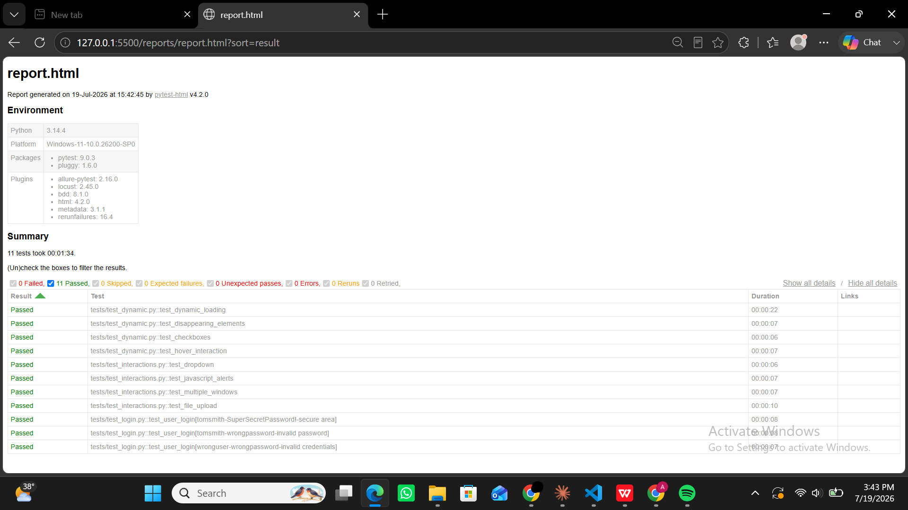

# Selenium Pytest Herokuapp Automation Suite

This repository features a comprehensive UI test automation suite designed to validate core web interactions and complex user interface components. Built with Python and Selenium WebDriver, it utilizes the Page Object Model (POM) pattern alongside custom synchronization strategies.

---

## Key Functional Scenarios Covered

*   **User Authentication:** Validates user login states using multi-condition parameterization.
*   **JavaScript Alert Management:** Handles native browser alert prompts, confirmation blocks, and input text alerts.
*   **Multi-Window Workspace Navigation:** Simulates browser tab generation and cleanly controls cross-window driver handle switches.
*   **Dynamic UI Elements:** Validates unstable application states including delayed loading elements and disappearing DOM links using explicit waits.
*   **Advanced User Actions:** Implements ActionChains for complex mouse hover simulations and hidden image tooltip extraction.
*   **Programmatic File Submissions:** Bypasses OS native file dialog limitations to seamlessly upload file payloads directly through input fields.

---

## Technical Architecture & Tools

*   **Language:** Python 3.11+
*   **Test Runner:** Pytest
*   **Reporting Interface:** Pytest-HTML (generates single-file self-contained HTML test logs)
*   **Automation Engine:** Selenium WebDriver

---

## Repository Directory Structure

```text
selenium-pytest-herokuapp-suite/
│
├── pages/                  # Page Object component wrappers and selectors
├── tests/                  # Pytest UI automation scripts
├── .gitignore              # Engine runtime clutter and local report isolation
├── config.py               # Centralized landing page URLs and static test credentials
└── conftest.py             # Global browser driver instantiation and HTML reporting hooks
```

---

## Local Installation & Execution Guide

### 1. Project Setup
```bash
# Clone the repository
git clone https://github.com
cd selenium-pytest-herokuapp-suite

# Create a virtual environment and activate it
python -m venv venv
source venv/bin/activate  # On Windows use: venv\Scripts\activate

# Install requirements (ensure selenium, pytest and pytest-html are present)
pip install selenium pytest pytest-html
```

### 2. Running the Test Suite
*   **Execute the Entire Automation Suite:**
    ```bash
    py -m pytest
    ```
*   **Run and Compile Self-Contained HTML Reports:**
    Your `conftest.py` hook is pre-configured to generate a report automatically upon test execution. Look inside the generated `reports/` folder for your local `report.html` file.

## Automated Test Execution Report

Here is a preview of the self-contained HTML report automatically generated after executing the regression test suite:


