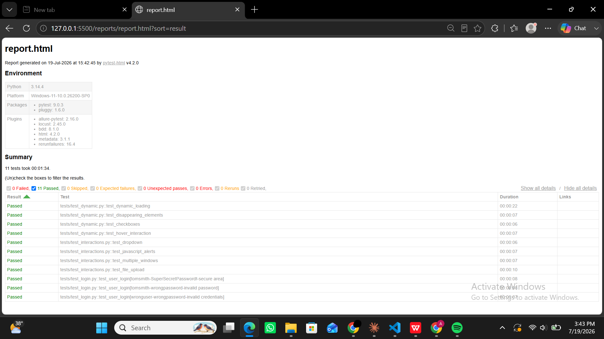

# Selenium Pytest Herokuapp Automation Suite

A UI test automation suite validating core web interactions and interface components on [The Internet (Herokuapp)](https://the-internet.herokuapp.com). Built with Python and Selenium WebDriver, using the Page Object Model and custom explicit-wait synchronization strategies.

## Scenarios covered

- **User authentication** — login validated across multiple parameterized credential combinations
- **JavaScript alerts** — handling native alert, confirm, and prompt dialogs
- **Multi-window navigation** — switching between browser tabs via driver handle management
- **Dynamic UI elements** — explicit waits for delayed-loading and disappearing DOM elements
- **Mouse actions** — `ActionChains`-based hover simulation and hidden tooltip extraction
- **File upload** — direct file submission through input fields, bypassing the native OS file dialog

## Tech stack

- **Language:** Python 3.11+
- **Automation:** Selenium WebDriver
- **Test runner:** pytest
- **Reporting:** pytest-html (self-contained local HTML report)

## Project structure

```text
selenium-pytest-herokuapp-suite/
├── pages/          # Page Object classes and selectors
├── tests/          # pytest UI automation scripts
├── config.py       # base URLs and test credentials
└── conftest.py     # browser driver setup and HTML reporting hook
```

## Setup

```bash
git clone https://github.com/Alisha640/selenium-pytest-herokuapp-suite.git
cd selenium-pytest-herokuapp-suite

python -m venv venv
source venv/bin/activate   # Windows: venv\Scripts\activate

pip install selenium pytest pytest-html
```

## Running tests

```bash
py -m pytest
```

The `conftest.py` hook generates an HTML report automatically after each run — check the `reports/` folder for `report.html`.

## Report



## Notes

This is a learning project built as part of a structured QA automation roadmap, focused on core Selenium interaction patterns and the Page Object Model.